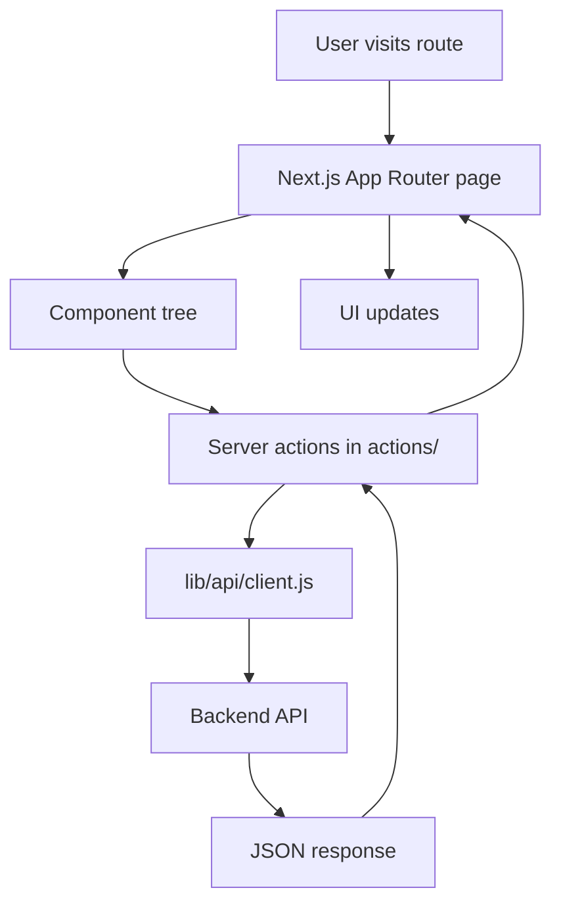
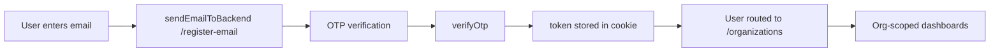
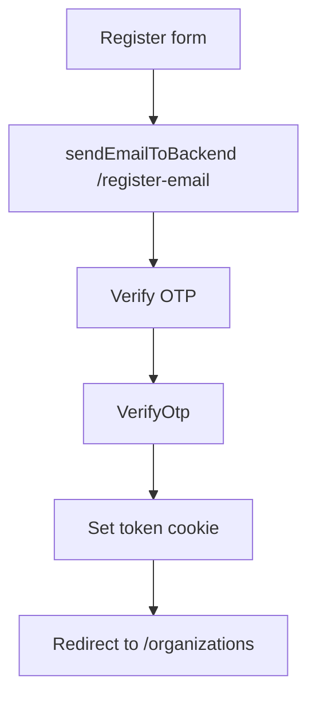

# OptimaSync Project Overview

## 1. Project Overview

### 1.1 Project name

The project is named OptimaSync and also appears as "Optima Sync" in the dashboard branding. The repository is a Next.js application with the package name `my-app`, but the product branding and route-level organization structure clearly indicate the system is OptimaSync.

### 1.2 What OptimaSync appears to be

Confirmed facts from the codebase:
- It is a Next.js 16 application using the App Router.
- It contains authentication, organization management, client/customer management, sales pipeline tracking, project management, marketing/campaign analytics, employee/member management, and settings pages.
- It communicates with a backend API at `https://optima.trio-verse.com/api/v1` (fallback in the shared API client).
- It is organized around organization-specific routes such as `/[OrgId]/dashboard/...`.

Reasonable observations:
- It appears to be a business operations/ERP-like platform for organizations, with CRM, project management, employee access, and marketing analytics combined into one product.
- The app is designed for multi-organization usage, where users select or manage an organization and the org ID is passed on nearly every API request.

Unknown information:
- The original product requirements, target audience, and product roadmap are not documented in the repository.
- The backend implementation is not present in this workspace, so the full server-side business logic cannot be fully inspected here.

### 1.3 Main purpose of the system

The application is centered on managing an organization’s operational data, especially:
- organizations and profile management
- clients and relationships
- sales/connections pipeline
- projects and project versions
- team members and roles
- marketing campaigns and content analytics
- reference data such as cities, industries, products, channels

### 1.4 Main business domains/features

Confirmed domains visible in the codebase:
- Authentication / user registration / OTP verification
- Organization onboarding and profile management
- Sales CRM / client relationship management
- Connections / deal pipeline
- Project management
- Employee/member administration
- Marketing campaign analytics
- Reference data management
- Content and campaign operations

### 1.5 Frontend, backend, or full-stack

This repository is primarily a frontend application with backend API integration.

Confirmed facts:
- There is no server-side backend framework in the repository root (no Laravel, Node Express service, or database project here).
- The codebase contains client-side pages and server actions that call a backend API.
- The API client is centralized in `lib/api/client.js` and uses `fetch` against a remote API base URL.

Conclusion:
- This is best described as a full-stack-style frontend app that integrates with a remote backend, but the backend itself is not included in the current workspace.

### 1.6 Main technologies/frameworks

Confirmed technologies:
- Next.js 16
- React 19
- JavaScript (with some TSX files)
- Tailwind CSS v4
- TanStack React Query
- React Hook Form / Zod validation
- Recharts for analytics charts
- Framer Motion for UI animation
- Lucide React icons
- js-cookie for cookie handling

### 1.7 Architecture style

Confirmed facts:
- App Router architecture (`app/` directory)
- Server Components and Client Components mixed through the app
- Shared server-side action layer in `actions/` for API calls
- Organization-scoped request pattern using header `X-Organization-ID`
- React Query for client-side data fetching and cache management

Reasonable observation:
- The project uses a layered architecture: route/page -> component -> action/service -> API client -> backend API.

### 1.8 Main application entry points

Main entry points:
- `app/page.jsx` -> root page loads `SystemGateway`
- `app/layout.js` -> root layout with providers and fonts
- `app/register/page.jsx` -> OTP registration flow
- `app/organizations/page.jsx` -> organization selection page
- `app/[OrgId]/dashboard/layout.jsx` -> organization dashboard shell
- `app/[OrgId]/dashboard/page.jsx` -> dashboard landing page

### 1.9 Important configuration files

Important config files in the repo:
- `package.json` -> dependencies, scripts, package manager metadata
- `next.config.mjs` -> Next.js config, React compiler, server actions size limit, remote image patterns
- `jsconfig.json` and `tsconfig.json` -> path aliases and TS/JS config
- `postcss.config.mjs` -> PostCSS configuration
- `eslint.config.mjs` -> linting config
- `app/globals.css` -> Tailwind import and global styling
- `.env.local` -> environment settings

### 1.10 Confirmed facts vs observations vs unknowns

Confirmed facts:
- The app is a Next.js-based organization management platform with CRM/project/marketing features.
- API calls are centralized via `lib/api/client.js`.
- Auth tokens and org context are passed via cookies and request headers.
- The project is scoped by organization ID in routes and headers.

Reasonable observations:
- It resembles a SaaS admin dashboard product for service businesses.
- It likely evolved from multiple business modules being combined into one portal.

Unknown information:
- The backend domain model and schema are not in the repo.
- Data model details like exact user roles/permissions beyond `admin` and `member` are not fully specified in the frontend.

---

## 2. Complete Project Structure

### 2.1 High-level tree

```text
OptimaSync/
├── .env.local
├── .git/
├── .gitignore
├── .next/
├── actions/
│   ├── activityActions.js
│   ├── auth.js
│   ├── campaignDetails.js
│   ├── campaigns.js
│   ├── clientActions.js
│   ├── connectionActions.js
│   ├── createNewOrganisation.js
│   ├── editOrgActions.js
│   ├── employeeActions.js
│   ├── employees.js
│   ├── expenseActions.js
│   ├── featureActions.js
│   ├── getActions.js
│   ├── getMyOrgs.js
│   ├── meetingActions.js
│   ├── mockProjectActions.js
│   ├── mockprojectDetailsActions.js
│   ├── projectAction.js
│   ├── projectDetailsAction.js
│   ├── publicProjectActions.js
│   ├── quotationActions.js
│   ├── registerUser.js
│   ├── versionActions.js
│   └── services/
│       ├── channelService.js
│       ├── cityService.js
│       ├── industryService.js
│       ├── membersAction.js
│       ├── productsService.js
│       └── stakeholderService.js
├── app/
│   ├── globals.css
│   ├── layout.js
│   ├── page.jsx
│   ├── create-profile/
│   ├── organizations/
│   ├── register/
│   ├── request-project/
│   └── [OrgId]/
│       ├── dashboard/
│       │   ├── clients/
│       │   ├── marketing/
│       │   ├── member/
│       │   ├── product/
│       │   ├── projects/
│       │   ├── reference-data/
│       │   ├── sales/
│       │   ├── settings/
│       │   ├── workspace/
│       │   ├── layout.jsx
│       │   └── page.jsx
│       └── upload-logo/
├── components/
│   ├── campaigns/
│   ├── connections/
│   ├── marketing/
│   ├── projects/
│   ├── workspace/
│   ├── ClientForm.jsx
│   ├── EmailStep.jsx
│   ├── LogoUploader.jsx
│   ├── OtpStep.jsx
│   ├── OrganisationForm.jsx
│   ├── OrganisationsList.jsx
│   ├── registerForm.jsx
│   ├── SystemGateway.jsx
│   ├── WelcomeNoOrg.jsx
│   └── ...
├── hooks/
│   ├── useClientLookups.js
│   ├── useConnectionSelects.js
│   ├── useMarketingAnalytics.js
│   └── useOrganisation.js
├── lib/
│   ├── api/
│   │   └── client.js
│   ├── mock/
│   │   └── campaignDetailsData.js
│   └── validations/
│       ├── campaignSchema.js
│       └── clientSchema.js
├── providers/
│   └── Providers.jsx
├── public/
├── README.md
├── eslint.config.mjs
├── jsconfig.json
├── next-env.d.ts
├── next.config.mjs
├── package.json
├── postcss.config.mjs
├── tsconfig.json
├── PROJECT_OVERVIEW.md
└── package-lock.json
```

### 2.2 Folder responsibilities

#### `app/`
Responsible for routing and page entry points. This is the App Router structure. Route groups and dynamic segments are heavily used for organization-scoped screens.

Important files:
- `app/page.jsx` -> home page gateway
- `app/register/page.jsx` -> OTP sign-up flow
- `app/organizations/page.jsx` -> organization selection page
- `app/[OrgId]/dashboard/layout.jsx` -> navigation shell for all org dashboard pages
- `app/[OrgId]/dashboard/page.jsx` -> dashboard overview
- `app/[OrgId]/dashboard/projects/page.jsx` -> project management listing
- `app/[OrgId]/dashboard/marketing/page.jsx` -> marketing analytics overview
- `app/[OrgId]/dashboard/clients/page.jsx` -> CRM client list
- `app/[OrgId]/dashboard/settings/profile/page.jsx` -> organization settings profile edit

How it interacts:
- Pages pull data via server actions and pass data to components.
- Dynamic `OrgId` route is used to scope and identify the active organization.

#### `components/`
This is the UI layer. It contains page-level and reusable components grouped by feature domain.

Important groups:
- `components/projects/` -> project listing, details, modals, tabs, header
- `components/campaigns/` -> campaigns list, campaign modal, content form, analytics view
- `components/connections/` -> connection activity, activity timeline, forms
- `components/marketing/` -> marketing analytics dashboard
- `components/workspace/` -> employee view, employee form, tasks
- `components/ClientForm.jsx` and `components/OrganisationForm.jsx` -> core forms
- `components/registerForm.jsx` -> registration and OTP UI

This folder is tightly integrated with `app/` as pages compose these components and with `actions/` as components call server actions or receive data from server page components.

#### `actions/`
This folder houses server-side API functions and logic. It acts as the application-layer boundary between pages/components and the remote backend.

Important files:
- `actions/auth.js` -> logout action
- `actions/registerUser.js` -> OTP send/verify flow
- `actions/getMyOrgs.js` -> fetch organizations for the current user
- `actions/clientActions.js` -> CRUD for clients
- `actions/projectAction.js` -> CRUD for projects
- `actions/campaigns.js` -> campaigns and marketing analytics
- `actions/connectionActions.js` -> CRM pipeline connection management
- `actions/services/membersAction.js` -> org member CRUD
- `actions/services/productsService.js`, `cityService.js`, `industryService.js`, `channelService.js` -> reference data services

How it interacts:
- The `actions` folder calls `lib/api/client.js` and wraps backend responses into application-friendly objects like `{ success, data, message }`.

#### `lib/`
The shared library layer.

Important files:
- `lib/api/client.js` -> single source for fetch-based API communication, auth token refresh, and error handling
- `lib/validations/clientSchema.js` -> client validation schema
- `lib/validations/campaignSchema.js` -> campaign validation schema
- `lib/mock/campaignDetailsData.js` -> mock data fixture for campaign detail demos

#### `hooks/`
Contains reusable React hooks for data lookup and analytics queries.

Important files:
- `hooks/useClientLookups.js` -> fetches cities and industries for clients
- `hooks/useConnectionSelects.js` -> fetches products, members, and campaigns
- `hooks/useMarketingAnalytics.js` -> aggregates marketing query calls
- `hooks/useOrganisation.js` -> fetches current organization by ID

#### `providers/`
- `providers/Providers.jsx` -> wraps children with React Query `QueryClientProvider`

#### `public/`
A standard Next.js public asset folder. The workspace listing does not show specific files under it, so its current contents are not fully defined in this repository snapshot.

#### `actions/services/`
This folder contains domain reference-data services (cities, industries, channels, products, members, stakeholders). It is intentionally separated from the main `actions` folder to keep business-data APIs organized.

#### `app/[OrgId]/dashboard/`
This is the multi-tenant dashboard shell and route root for a specific organization. It includes route segments for clients, projects, marketing, sales, workspace, member management, product data, and settings.

---

## 3. Technology Stack

### 3.1 Frontend

Framework:
- Next.js 16.2.10
- React 19.2.4

Language:
- JavaScript is the dominant language (`.js` and `.jsx` files)
- Some files use `.tsx` (`app/[OrgId]/dashboard/workspace/page.tsx`)

Styling:
- Tailwind CSS v4 (`@import "tailwindcss"` in `app/globals.css`)
- custom CSS variables for fonts and light theme

UI libraries:
- `lucide-react`
- `framer-motion`
- `recharts`

State management:
- React Query via `@tanstack/react-query`
- local component state with `useState`, `useEffect`, `useMemo`, `useCallback`
- No Redux, Zustand, or Context API store is found in the current codebase

Data fetching:
- Server actions and direct `fetch` via `apiFetch`
- TanStack Query for client data fetching (especially in dashboard list pages)

Form handling:
- `react-hook-form` is installed but not clearly central to the app. The code uses direct form state and handler logic more often than a form library abstraction.
- `@hookform/resolvers` and `zod` are present, supporting form validation patterns.

Validation:
- `lib/validations/clientSchema.js`
- `lib/validations/campaignSchema.js`
- many inline validation checks in components

Charts/analytics:
- `recharts`

Routing:
- Next.js App Router with dynamic org routes and nested dashboard routes

Authentication libraries:
- `js-cookie` is present, but the code also writes cookies directly via `document.cookie` in some places
- No dedicated auth provider library or NextAuth integration is present

### 3.2 Backend/API integration

API technology:
- REST-style HTTP API, called using `fetch` from a centralized client
- Backend is not in the workspace; it appears to be a separate Laravel-like API service (`api/v1` patterns and organization headers suggest a Laravel backend)

API base URL configuration:
- `lib/api/client.js` uses:
  - `process.env.NEXT_PUBLIC_API_BASE_URL`
  - fallback to `https://optima.trio-verse.com/api/v1`
- `.env.local` defines `API_BASE_URL = https://optima.trio-verse.com/api/v1;`

HTTP client:
- native `fetch` is used, not Axios

Authentication mechanism:
- JWT token in a cookie named `token`
- Authorization headers: `Authorization: Bearer <token>`
- Organization-scoped requests: header `X-Organization-ID` or `x-organization-id`

API response/error handling:
- `apiFetch` wraps responses, throws on `!response.ok`, and attaches `error.status` and `error.data`
- server actions normally return `{ success, message, data, errors }`

### 3.3 Development tooling

Node version:
- Not explicitly specified in the repo.

Package manager:
- `package-lock.json` is present; package manager is not explicitly declared in `package.json`

Build tools:
- Next.js build system
- PostCSS + Tailwind

ESLint:
- `eslint.config.mjs` with `eslint-config-next`

Prettier:
- Not found in the current codebase

TypeScript configuration:
- `tsconfig.json` exists and enables JS compatibility (`allowJs: true`)

Environment variables:
- `NEXT_PUBLIC_API_BASE_URL` is referenced in code
- `.env.local` contains `API_BASE_URL = https://optima.trio-verse.com/api/v1;`

Other tooling:
- `reactCompiler: true` in `next.config.mjs`
- remote image support for `optima.trio-verse.com`

---

## 4. Architecture

### 4.1 Overall architecture

The project follows a classic client/server UI pattern with a remote API backend:



### 4.2 Folder-based architecture

- `app/` defines page routes
- `components/` houses UI
- `actions/` wraps backend API calls and mutations
- `hooks/` encapsulates reusable data fetching logic
- `lib/` contains validation, API client, and support utilities
- `providers/` supplies React Query context

### 4.3 Component architecture

The codebase uses a mixed component model:
- Server components render page data on the server
- Client components handle interactivity, local state, and browser-based UX
- Feature modules such as projects and campaigns have domain-specific subcomponents

### 4.4 Data flow

Typical flow:
1. User navigates to `/[OrgId]/dashboard/...`
2. Page resolves `OrgId`
3. Server action fetches data using the current auth token and org ID
4. Result is returned as `{ success, data, message }`
5. Page or client component renders the UI
6. For interactive updates, the client side calls a server action or React Query operation

### 4.5 API flow

The private API flow is essentially:
- read token from cookie
- build URL with backend base URL + endpoint
- attach `Authorization: Bearer <token>`
- attach `X-Organization-ID` header
- call `fetch`
- parse JSON
- throw on error if `response.ok` is false

### 4.6 Authentication flow



### 4.7 State management flow

- Query cache: `QueryClientProvider` in `providers/Providers.jsx`
- Server state: React Query for clients, marketing analytics, campaigns, and client lookups
- Local UI state: `useState` for forms, modals, filters, loading, and tabs
- URL state: dynamic route parameters (`[OrgId]`, `[projectId]`, `[id]`)

### 4.8 Form submission flow

- form fields are managed locally with `useState`
- validation is often done before calling the server action
- action submits to backend API using `api.post/patch/delete`
- success or error messages are set in local state

### 4.9 Error handling flow

Observed patterns:
- API wrappers catch errors and return a normalized object
- client UI surfaces `message` and `errors`
- Many components show user-facing message banners or inline validation
- `console.error` is used heavily for debugging

### 4.10 Loading states

There are many explicit loading flags (`loading`, `isLoading`, `isFetchingNextPage`, etc.), but some pages do not implement complete skeleton states uniformly.

### 4.11 Permission/authorization handling

Confirmed facts:
- tokens are read from cookies before API access
- `Unauthorized` is returned when no token exists
- role values include `admin` and `member` in the member management page

Not fully found in the codebase:
- A centralized permission system or role guards are not found in the repo

### 4.12 Organization / multi-tenancy handling

Confirmed facts:
- the route is scoped by `[OrgId]`
- `X-Organization-ID` is sent on nearly all API requests
- organization data is frequently passed into actions as `orgId`
- `getMyOrganisations()` fetches the user’s organizations

This strongly indicates a multi-tenant or multi-organization app structure.

---

## 5. Routing Structure

### 5.1 Public routes

| Route | Purpose | Authentication | Dynamic Params | Important Components |
|---|---|---|---|---|
| `/` | Entry page / gateway | No | No | `SystemGateway` |
| `/register` | OTP email registration flow | No | No | `registerForm.jsx` |
| `/organizations` | List user organizations | Yes (token required) | No | `OrganisationsList`, `WelcomeNoOrg` |
| `/create-profile` | Create organization profile | Likely yes | No | `OrganisationForm` |
| `/request-project/[reqId]` | Public project intake page | Not clearly enforced in the page | `[reqId]` | `ProjectIntakeForm` |

### 5.2 Dashboard routes

| Route | Purpose | Authentication | Dynamic Params | Important Components |
|---|---|---|---|---|
| `/[OrgId]/dashboard` | Main dashboard | Yes | `OrgId` | dashboard overview |
| `/[OrgId]/dashboard/clients` | CRM client list | Yes | `OrgId` | `ClientsListPage` |
| `/[OrgId]/dashboard/clients/create` | Create client | Yes | `OrgId` | `ClientForm` |
| `/[OrgId]/dashboard/clients/[id]` | Client detail | Yes | `OrgId`, `id` | client detail page |
| `/[OrgId]/dashboard/projects` | Project list | Yes | `OrgId` | `ProjectsTable` |
| `/[OrgId]/dashboard/projects/[projectId]` | Project detail | Yes | `OrgId`, `projectId` | `ProjectDeatails` |
| `/[OrgId]/dashboard/member` | Team member list | Yes | `OrgId` | `MembersPage` |
| `/[OrgId]/dashboard/workspace` | employee workspace | Yes | `OrgId` | `EmployeeView` |
| `/[OrgId]/dashboard/sales` | sales dashboard | Yes | `OrgId` | dashboard stats |
| `/[OrgId]/dashboard/product` | product reference/listing | Yes | `OrgId` | product-related components |
| `/[OrgId]/dashboard/marketing` | marketing overview | Yes | `OrgId` | `MarketingAnalyticsDashboard` |
| `/[OrgId]/dashboard/marketing/campaigns` | campaigns list | Yes | `OrgId` | `CampaignsTable` |
| `/[OrgId]/dashboard/marketing/campaigns/[id]` | campaign details | Yes | `OrgId`, `id` | `CampaignModal`, `ContentKanban` |
| `/[OrgId]/dashboard/marketing/campaigns/[id]/content` | campaign content form | Yes | `OrgId`, `id` | `ContentForm` |
| `/[OrgId]/dashboard/reference-data` | reference data | Yes | `OrgId` | reference-data modules |
| `/[OrgId]/dashboard/settings/profile` | org profile edit | Yes | `OrgId` | `OrganisationForm` |
| `/[OrgId]/upload-logo` | upload org logo | Yes | `OrgId` | `LogoUploader` |

### 5.3 App Router notes

Confirmed observations:
- The repository uses the App Router (`app/` folder)
- Dynamic segments are used for organization and project IDs
- `layout.jsx` in `app/[OrgId]/dashboard` acts as a dashboard shell
- No `loading.js`, `error.js`, or `middleware.js` files are found in the current project structure

---

## 6. Component Architecture

### 6.1 Layout and navigation

- `app/[OrgId]/dashboard/layout.jsx` -> main sidebar navigation and auth/logout action
- It decides active tab based on route path
- It includes a top-level nav for Sales, Member, Product, Marketing, Clients, Employees, Reference Data, Settings

### 6.2 Dashboard

- `components/marketing/MarketingAnalyticsDashboard.jsx` -> marketing analytics dashboard with KPI cards and charts
- `app/[OrgId]/dashboard/page.jsx` -> likely dashboard landing page; actual implementation is not fully visible in the initial read but exists as a page route
- `app/[OrgId]/dashboard/sales/page.jsx` -> a sales dashboard for clients, connections, and conversion metrics

### 6.3 Workspace

- `components/workspace/EmployeeView.jsx` -> employee roster and team view
- `components/workspace/EmployeeForm.jsx` -> employee add/edit form
- `components/workspace/CreateTaskModal.jsx` -> task creation modal
- `components/workspace/TaskCard.jsx` -> card for task representation

### 6.4 Projects

- `components/projects/ProjectTableRow.jsx` -> list, filters, CRUD modal, project actions
- `components/projects/ProjectHeader.jsx` -> project header UI
- `components/projects/ProjectModal.jsx` -> create/edit project form modal
- `components/projects/ProjectDeatails.jsx` -> detailed project view
- `components/projects/OverviewTab.jsx`, `FeaturesTab.jsx`, `ExpensesTab.jsx`, `MeetingsTab.jsx`, `VersionsTab.jsx` -> domain-specific detail tabs

### 6.5 CRM

- `components/ClientForm.jsx` -> client create/edit form
- `components/connections/ConnectionForm.jsx`, `ConnectionModal`, `ActivityList`, `ActivityModal`, `ConnectionsTimeline` -> sales pipeline and connection history
- `app/[OrgId]/dashboard/clients/page.jsx` -> client listing and filtering page

### 6.6 Analytics

- `components/marketing/MarketingAnalyticsDashboard.jsx` -> main analytics UI powered by `recharts`
- `hooks/useMarketingAnalytics.js` -> wrapper around `getMarketingAnalytics`, `getEffectiveCampaigns`, and `getAllCampaigns`

### 6.7 Forms

- `components/OrganisationForm.jsx` -> create/edit organization form
- `components/registerForm.jsx` -> sign-up and OTP verification form flow
- `components/ClientForm.jsx` -> client validation form
- `components/projects/ProjectIntakeForm.jsx` -> public intake or project form

### 6.8 Shared/reusable components

- `LogoUploader.jsx`
- `WelcomeNoOrg.jsx`
- `OrganisationsList.jsx`
- `SystemGateway.jsx`

These are used across the onboarding and organization-selection flow.

---

## 7. API Integration

### 7.1 Central API client

The central API client is `lib/api/client.js`.

Responsibilities:
- sets a base URL from `NEXT_PUBLIC_API_BASE_URL` or fallback to `https://optima.trio-verse.com/api/v1`
- reads token from `cookies()`
- refreshes expiring tokens via `/auth/refresh`
- attaches `Authorization: Bearer <token>`
- attaches `X-Organization-ID` when passed in action options
- serializes JSON body or FormData automatically
- redirects to `/register` after 401 when refresh fails

### 7.2 Request lifecycle

The actual request lifecycle in `apiFetch` is:
1. read token from cookie
2. if token is close to expiry, refresh it
3. build full URL
4. add query string params when present
5. set default JSON headers
6. handle FormData if needed
7. execute `fetch`
8. if response status is 401, attempt refresh
9. parse JSON and throw on non-OK response

### 7.3 API table

| Method | Endpoint | Purpose | Used By | Auth |
|---|---|---|---|---|
| POST | `/register-email` | Send OTP email | `actions/registerUser.js` | No explicit token required |
| POST | `/verify-otp` | Verify OTP and receive user token | `actions/registerUser.js` | No explicit token required |
| GET | `/organizations/myOrgs` | Get organizations for current user | `actions/getMyOrgs.js` | Yes (token) |
| GET | `/organizations/{id}` | Fetch org details/logo | `actions/getActions.js` | Yes |
| POST | `/organizations` | Create organization | `actions/createNewOrganisation.js` | Yes |
| PATCH | `/organizations/{id}` | Update organization profile | `actions/editOrgActions.js` | Yes |
| POST | `/organizations/{id}/logo` | Upload logo | `actions/createNewOrganisation.js` / `editOrgActions.js` | Yes |
| GET | `/organizations/{id}/members` | Fetch team members | `actions/services/membersAction.js` | Yes |
| POST | `/organizations/{id}/members` | Add member | `actions/services/membersAction.js` | Yes |
| PATCH | `/organizations/{id}/members/{memberId}` | Update member role | `actions/services/membersAction.js` | Yes |
| DELETE | `/organizations/{id}/members/{memberId}` | Remove member | `actions/services/membersAction.js` | Yes |
| GET | `/clients` | Fetch clients with filters | `actions/clientActions.js` | Yes |
| POST | `/clients` | Create client | `actions/clientActions.js` | Yes |
| PATCH | `/clients/{id}` | Update client | `actions/clientActions.js` | Yes |
| DELETE | `/clients/{id}` | Delete client | `actions/clientActions.js` | Yes |
| GET | `/clients/{id}/connections` | Fetch client connections | `actions/connectionActions.js` | Yes |
| POST | `/clients/{id}/connections` | Create connection | `actions/connectionActions.js` | Yes |
| PATCH | `/connections/{connection_id}` | Update connection | `actions/connectionActions.js` | Yes |
| DELETE | `/connections/{connection_id}` | Delete connection | `actions/connectionActions.js` | Yes |
| POST | `/connections/{id}/stage` | Update connection stage | `actions/connectionActions.js` | Yes |
| GET | `/projects` | Fetch projects | `actions/projectAction.js` | Yes |
| POST | `/projects` | Create project | `actions/projectAction.js` | Yes |
| PATCH | `/projects/{id}` | Update project | `actions/projectAction.js` | Yes |
| DELETE | `/projects/{id}` | Delete project | `actions/projectAction.js` | Yes |
| GET | `/projects/{id}` | Fetch project details | `actions/projectDetailsAction.js` | Yes |
| GET | `/campaigns` | Fetch campaigns | `actions/campaigns.js` | Yes |
| POST | `/campaigns` | Create campaign | `actions/campaigns.js` | Yes |
| PATCH | `/campaigns/{id}` | Update campaign | `actions/campaigns.js` | Yes |
| DELETE | `/campaigns/{id}` | Delete campaign | `actions/campaigns.js` | Yes |
| GET | `/marketing/analytics` | Fetch marketing KPIs | `actions/campaigns.js` | Yes |
| GET | `/cities` | Fetch city reference data | `actions/services/cityService.js` | Yes |
| GET | `/industries` | Fetch industry reference data | `actions/services/industryService.js` | Yes |
| GET | `/products` | Fetch products | `actions/services/productsService.js` | Yes |
| GET | `/channels` | Fetch channels | `actions/services/channelService.js` | Yes |

### 7.4 Response handling conventions

Common return shapes:
- `{ success: true, data: ..., message: ... }`
- `{ success: false, message: ..., errors: ... }`
- Some functions also return `meta` for paginated results

---

## 8. Authentication & Authorization

### 8.1 Login / registration flow

The auth path is based on email OTP, not password login.

Confirmed flow:
1. User enters email in `components/registerForm.jsx`
2. `sendOtpToEmail` calls backend `/register-email`
3. User enters OTP code
4. `VerifyOtp` calls backend `/verify-otp`
5. A token is stored in a cookie named `token`
6. User is routed to `/organizations`

Important files:
- `actions/registerUser.js`
- `components/registerForm.jsx`

### 8.2 Logout flow

`actions/auth.js` defines a server action that deletes cookies and redirects to `/register`.

Observed issue:
- It deletes `tokien` instead of `token`, which is a typo and likely broken logic.

### 8.3 Token/session handling

Confirmed facts:
- Token is stored in a cookie named `token`
- `lib/api/client.js` reads the cookie via `cookies()` and attaches it to the `Authorization` header
- refresh logic attempts `POST /auth/refresh` when the current token is near expiration
- expired/invalid auth leads to redirect to `/register`

### 8.4 Storage mechanism

- Cookies are the main storage mechanism
- `document.cookie` is used directly in the client registration form for token set, while server actions also use `cookies()` from `next/headers`

### 8.5 Protected routes

There is no explicit `middleware.js` or route guard file found in the workspace. Protection appears to be enforced by server actions checking the token cookie before doing API calls.

This means route-level protection is not centralized; business logic is distributed across actions.

### 8.6 Auth context/store

Not found in the current codebase:
- No auth context provider
- No Redux auth slice
- No Zustand auth store
- No JWT decoding library in use beyond manual `atob` parsing inside `lib/api/client.js`

### 8.7 User information

The app uses the token and the organization route to identify the active user and organization; user profile data is not clearly centralized in a dedicated user store.

### 8.8 Organization selection

The flow is:
- user authenticates
- app loads `/organizations`
- `getMyOrganisations()` fetches all organizations
- the user chooses one
- the UI navigates to `/[OrgId]/dashboard`

### 8.9 Role/permission handling

Confirmed:
- `admin` and `member` roles appear in member management (`app/[OrgId]/dashboard/member/page.jsx`)

Not fully found:
- No distinction in the dashboard layout or route guards between admin and member roles is visible in the codebase so far.

### 8.10 Unauthorized flow

Server actions often return:
- `{ success: false, message: "Unauthorized" }`
- or `return { success: false, message: ... }`

The shared API client also redirects to `/register` if a request returns 401 after token refresh fails.

---

## 9. Multi-Tenancy / Organizations

### 9.1 Organization ID handling

This is one of the strongest patterns in the repo.

Confirmed patterns:
- route segment `[OrgId]` is appended to most dashboard URLs
- almost every API call includes `X-Organization-ID: orgId`
- payloads include `organization_id: orgId`
- organization-specific actions use `orgId` strongly in their signatures

### 9.2 URL structure

Example routes:
- `/[OrgId]/dashboard`
- `/[OrgId]/dashboard/clients`
- `/[OrgId]/dashboard/projects`
- `/[OrgId]/dashboard/marketing`

This strongly indicates organization-based tenant routing.

### 9.3 Organization context

The codebase includes:
- `getMyOrganisations()` -> get current user’s orgs
- `getOrganisationById()` -> current org details
- `useOrganisation()` -> loads organization context for client components

### 9.4 Organization switching

The app allows organization selection via the `/organizations` page and then navigates to the dashboard with the selected org ID.

### 9.5 Organization-related API calls

Examples:
- `/organizations/myOrgs`
- `/organizations/{id}`
- `/organizations/{id}/members`
- `/organizations/{id}/logo`

### 9.6 Scope of data

The data is generally scoped by organization ID in both URL and headers.

### 9.7 Role/permission model related to organizations

The code confirms member roles but not a complex permission matrix. The dashboard shows both member and admin state in the member management feature, but no fine-grained access control system is found.

---

## 10. Project Management Domain

### 10.1 Project pages

Routes:
- `/[OrgId]/dashboard/projects`
- `/[OrgId]/dashboard/projects/[projectId]`

Key files:
- `actions/projectAction.js`
- `actions/projectDetailsAction.js`
- `components/projects/ProjectTableRow.jsx`
- `components/projects/ProjectDeatails.jsx`
- `components/projects/ProjectModal.jsx`

### 10.2 Project creation

`createProject(orgId, formData)` in `actions/projectAction.js` creates a project with payload including:
- `client_id`
- `title`
- `description`
- `start_date`
- `end_date`
- `duration`
- `sub_total`
- `profit_percentage`
- `total_amount`

### 10.3 Project editing

`updateProject(orgId, projectId, formData)` allows updates to project metadata and financial details.

### 10.4 Project details

`getProjectById(orgId, projectId)` fetches project details from `/projects/{projectId}`.

The detail page passes data into `ProjectDetailsView` and supports tab-based views.

### 10.5 Project members

Related actions:
- `actions/employeeActions.js`
- `actions/featureActions.js`
- `actions/meetingActions.js`
- `actions/versionActions.js`
- `actions/expenseActions.js`

This indicates projects may have employees, features, meetings, versions, and costs.

### 10.6 Project status

The project tables and detail components support status values such as `pending`, `in_progress`, and likely other statuses depending on backend.

### 10.7 Tasks if present

The workspace area includes task-related components:
- `components/workspace/CreateTaskModal.jsx`
- `components/workspace/TaskCard.jsx`

There is no clear project task API in the action layer beyond generic workspace/task-like UI, so this appears to be a partial or adjacent feature rather than a fully developed task system.

### 10.8 Project analytics

Not strongly present as a dedicated project analytics module beyond general marketing analytics and sales dashboards.

### 10.9 Project filters

`ProjectTableRow.jsx` includes local search and status filtering in the UI, including:
- `searchQuery`
- `statusFilter`
- project tables and modal actions

### 10.10 Project APIs

Project-related API endpoints are:
- `GET /projects`
- `POST /projects`
- `GET /projects/{id}`
- `PATCH /projects/{id}`
- `DELETE /projects/{id}`

### 10.11 Complete project data flow

```mermaid
flowchart TD
    A[User opens /[OrgId]/dashboard/projects] --> B[ProjectsTable]
    B --> C[getProjects(orgId)]
    C --> D[api.get('/projects') with X-Organization-ID]
    D --> E[Project list data]
    E --> F[Project row actions]
    F --> G[create/update/delete project]
    G --> H[revalidate path /[OrgId]/dashboard/projects]
```

---

## 11. CRM Domain

### 11.1 Customers/clients

Confirmed files:
- `actions/clientActions.js`
- `components/ClientForm.jsx`
- `app/[OrgId]/dashboard/clients/page.jsx`

Clients have fields such as:
- name
- email
- phone
- whatsapp
- address
- type
- city_id
- industry_id
- client_type
- organization_id

### 11.2 Contacts

The client data model includes contact info, phone, email, and website/social fields.

### 11.3 Leads / deals / opportunities

The app includes a sales/connections pipeline:
- `actions/connectionActions.js`
- `components/connections/ConnectionsTimeline.jsx`
- `components/connections/ConnectionForm.jsx`
- `app/[OrgId]/dashboard/sales/page.jsx`

The connection stage model includes stage values such as:
- `lead`
- `conected`
- `missing_info`
- `intrested`
- `not_intrested`
- `win`
- `closed`

These values appear in the sales dashboard logic.

### 11.4 Companies

Client type values include:
- company
- individual
- government
- charity
- agency

### 11.5 Activities

There are activity-related files:
- `actions/activityActions.js`
- `components/connections/ActivityList.jsx`
- `components/connections/ActivityModal.jsx`

### 11.6 CRUD operations

Client CRUD is implemented in `actions/clientActions.js`.
Connection CRUD is implemented in `actions/connectionActions.js`.

### 11.7 Filters and search

The client page supports:
- client name search
- contact search
- city filter
- industry filter
- type filter
- infinite scrolling pagination

### 11.8 API integration

CRM endpoints in code include:
- `/clients`
- `/clients/{id}/connections`
- `/connections/{id}`
- `/connections/{id}/stage`

---

## 12. Analytics Domain

### 12.1 Analytics pages

- `/[OrgId]/dashboard/marketing`
- `components/marketing/MarketingAnalyticsDashboard.jsx`
- `hooks/useMarketingAnalytics.js`

### 12.2 KPI cards and charts

The analytics dashboard uses `recharts` to render:
- bar charts
- pie/donut charts
- radial gauges
- KPI cards

The code clearly includes metrics such as:
- total campaigns
- active campaigns
- total spent
- total connections
- total wins
- total revenue
- CPL
- ROI
- win rate

### 12.3 Filters and date ranges

The code does not show a general analytics filter system with date range inputs in the initial reads; rather, the marketing analytics page mostly ingests pre-calculated analytics plus campaigns counts.

There is likely some filtering logic in the campaign list and analytics card computations, but no standalone generic filter engine was found in the visible project.

### 12.4 Aggregation logic

The analytics dashboard calculates derived metrics such as:
- win rate = `totalWins / totalConnections * 100`
- ROI from analytics data
- active campaign counts from campaign status
- expected content totals from campaign lists

### 12.5 API calls

Marketing analytics actions:
- `getMarketingAnalytics(orgId)` -> `GET /marketing/analytics`
- `getEffectiveCampaigns(orgId)` -> likely a campaign query with effective filtering
- `getAllCampaigns(orgId)` -> campaign list fetch

### 12.6 Data transformation

The analytics component processes backend data into per-campaign metrics, `kpiData`, and display-friendly chart arrays.

### 12.7 Chart libraries

Confirmed:
- `recharts`

---

## 13. State Management

### 13.1 React state

Used throughout the app for modals, form values, search states, loading states, and UI toggles.

Examples:
- `useState` for filters and form data in `app/[OrgId]/dashboard/clients/page.jsx`
- `useState` for project modal states in `components/projects/ProjectTableRow.jsx`
- `useState` for form errors and success messages in `components/registerForm.jsx`

### 13.2 Context

Not found in the current codebase:
- No global app context provider beyond `QueryClientProvider`
- No auth context/store

### 13.3 TanStack Query

Used in:
- `providers/Providers.jsx`
- `hooks/useClientLookups.js`
- `hooks/useMarketingAnalytics.js`
- `app/[OrgId]/dashboard/clients/page.jsx` for infinite list fetching

Purpose:
- caching and fetching server data from action functions
- coalescing repeated queries

### 13.4 URL state

Used via dynamic route parameters (`[OrgId]`, `[projectId]`, etc.) and query string parameters in some actions.

### 13.5 Server state

Server state is represented by data returned from action functions and passed to client components or loaded via React Query.

### 13.6 Local storage / session storage / cookies

Confirmed:
- cookie-based auth token management
- direct use of `document.cookie` in `registerForm.jsx`
- `cookies()` in server actions

Not found:
- sessionStorage store
- localStorage app state persistence

---

## 14. Forms & Validation

### 14.1 Form libraries

Confirmed libraries:
- `react-hook-form` is installed
- `@hookform/resolvers` is installed
- `zod` is installed

Observed usage:
- The app often uses native `useState` forms instead of a central form library abstraction.
- Validation schemas are used in a few specific modules.

### 14.2 Validation schemas

Files:
- `lib/validations/clientSchema.js`
- `lib/validations/campaignSchema.js`

Examples:
- client name, phone, and city/industry validation
- campaign name/description/date and budget validation

### 14.3 Representative forms

#### Employee form
- `components/workspace/EmployeeForm.jsx`
- Used to add employees/members to the org

#### Project form
- `components/projects/ProjectModal.jsx`
- Used to create and edit projects; includes client attachment, sub-total, profit percentage, dates, and status

#### Organization form
- `components/OrganisationForm.jsx`
- Handles name, email, phone, address, description, and optional logo upload

#### CRM forms
- `components/ClientForm.jsx`
- `components/connections/ConnectionForm.jsx`

### 14.4 Submission flow

Common pattern:
- validate locally
- call server action (e.g., `createClient`, `createProject`)
- update local state or reload data
- show success or error message

---

## 15. UI / Design System

### 15.1 CSS approach

- Global CSS is in `app/globals.css`
- Tailwind CSS v4 is imported via `@import "tailwindcss"`
- Many pages use utility classes directly inside JSX
- The UI relies heavily on utility classes and component-local style variants

### 15.2 Theme

The app primarily uses:
- white and zinc/slate backgrounds
- blue as the primary accent color
- strong heading styles and rounded card layouts
- modern SaaS dashboard styling

### 15.3 Responsive behavior

The layout and components often use utility classes like:
- `sm:`, `md:`, `lg:` responsive media queries
- card/grid layouts that adapt to mobile and desktop

### 15.4 Dark mode

Not found in the current codebase:
- no dark theme implementation was identified
- `app/globals.css` explicitly comments out a dark mode media query

### 15.5 Reusable conventions

The project uses a consistent visual language:
- rounded cards
- subtle borders
- soft backgrounds
- dashboards with KPI tiles and bar charts
- buttons with strong blue accent color

---

## 16. Important Technical Decisions

| Decision | Current Implementation | Evidence | Reason/Context |
|---|---|---|---|
| Use Next.js App Router | Pages live under `app/` with route directories and nested layouts | `app/layout.js`, `app/[OrgId]/dashboard/layout.jsx` | The codebase is structured around the App Router pattern |
| Centralize API access | All backend calls pass through `lib/api/client.js` | `actions/*` call `api.get/post/...` | Reduces duplication and standardizes auth/headers |
| Use cookie-based auth | Token and auth refresh are stored/handled via cookies | `cookies()` and `Authorization: Bearer` in `lib/api/client.js` | The backend and frontend use cookie-backed authentication |
| Scope everything by org | Most routes and API calls include `OrgId` | `[OrgId]` routes and `X-Organization-ID` headers | Indicates organization-scoped data access |
| Use React Query | Data fetching is placed in query hooks and `QueryClientProvider` | `providers/Providers.jsx`, `hooks/useMarketingAnalytics.js` | Helps fetch and cache dashboard data |
| Use Tailwind for styling | Utility classes dominate component design | `app/globals.css`, many JSX files | Common in modern Next.js UIs |
| Use server actions for backend calls | `actions/*.js` wrap backend calls | Files under `actions/` | Keeps route pages thin and API logic separated |
| Use JS rather than TS for most modules | Most files are `.js/.jsx` | repo structure and files | The project is mostly JavaScript-based despite a TS config |
| Use `fetch` instead of Axios | `lib/api/client.js` uses native `fetch` | `fetch` calls throughout `apiFetch` | The repo standardizes on the Web fetch API |
| Use `recharts` for analytics | Chart building is done with `recharts` components | `components/marketing/MarketingAnalyticsDashboard.jsx` | Analytics pages need chart rendering |

### 16.1 Unknown or undocumented reasons

The codebase does not document why the project chose:
- OTP email auth instead of password auth
- `document.cookie` in one part and server `cookies()` in another
- `X-Organization-ID` header style vs another pattern
- combination of App Router and server actions with a remote backend

---

## 17. Coding Conventions

### 17.1 Naming conventions

- Files are mostly lower-case or CamelCase depending on feature area, for example `clientActions.js`, `CampaignsTable.jsx`, `ProjectDeatails.jsx`
- Some files have naming inconsistencies such as `ProjectDeatails.jsx` (typo), `mockprojectDetailsActions.js` (lower/upper case mismatch), `OrganisationForm.jsx` vs `OrganisationsList.jsx`
- Functions usually follow clear verbs: `getClients`, `createProject`, `updateMember`, `deleteCampaign`

### 17.2 File naming

- `app/` uses route directories and route segments by feature
- `actions/` groups domain actions by resource
- `components/` groups by feature or page type

### 17.3 Function patterns

Typical pattern:
- check token
- check orgId or required params
- call `api.get/post/patch/delete`
- return normalized `{ success, data, message }`

### 17.4 Async patterns

- Most server actions use `try/catch`
- Many functions are `async` and return consistent object shapes

### 17.5 React patterns

- `useState` and `useEffect` are heavily used for local UI state
- `useQuery` / `useInfiniteQuery` are used for fetching and pagination
- `use(params)` is used in some route-aware components in Next.js 15-style signatures

### 17.6 Import conventions

- `@/` alias is used widely
- Many files directly import from `@/actions/...` and `@/components/...`

---

## 18. Environment Variables & Configuration

### 18.1 Referenced env variables

- `NEXT_PUBLIC_API_BASE_URL`
  - Purpose: specifies the backend API base URL used by `lib/api/client.js`

- `API_BASE_URL`
  - Purpose: present in `.env.local` as the configured backend base URL value

### 18.2 Notable config files

- `next.config.mjs`
  - `reactCompiler: true`
  - server actions body size limit: 10MB
  - remote image host configuration for `optima.trio-verse.com`

- `jsconfig.json` and `tsconfig.json`
  - alias `@/*` mapped to repo root

- `app/globals.css`
  - Tailwind import and design tokens

### 18.3 Secret handling note

The repository contains a `.env.local` file, but this document does not include any secret values or credentials.

---

## 19. Dependencies

### 19.1 Framework

- `next` -> core web framework
- `react` and `react-dom` -> UI framework

### 19.2 UI

- `lucide-react` -> icons
- `framer-motion` -> UI animation
- `tailwindcss` -> styling framework

### 19.3 State management

- `@tanstack/react-query` -> server-state management and cache

### 19.4 API and auth

- `js-cookie` -> cookie access helper

### 19.5 Forms and validation

- `react-hook-form`
- `@hookform/resolvers`
- `zod`

### 19.6 Charts and analytics

- `recharts`

### 19.7 Utilities

- `react-intersection-observer` -> infinite scroll trigger pattern

### 19.8 Development tooling

- `eslint` and `eslint-config-next`
- `@tailwindcss/postcss`
- `@types/node` and `@types/react`
- `babel-plugin-react-compiler`

---

## 20. Current Implementation Status

### 20.1 Completed features

The codebase shows a functioning organization-scoped dashboard with:
- OTP-based sign-up/login flow
- organization onboarding
- organization dashboard layout
- client management
- sales/connection pipeline
- projects module
- campaign and marketing analytics
- workspace/member management

### 20.2 Partially implemented features

Examples:
- `app/[OrgId]/dashboard/product` and related product pages are present in the sidebar but less clearly fleshed out in the visible files
- project tasks/workspace tasks appear partial or adjacent rather than fully integrated
- some route pages are present but their full UI is not visible in the initial read

### 20.3 TODO / FIXME / placeholders

Confirmed TODO or FIXME markers:
- Not found in the initial repo scan

Observed placeholder-like patterns:
- `mockProjectActions.js` and `mockprojectDetailsActions.js` are definitely mock/demo data files
- `ProjectDeatails.jsx` has a consistent typo in the component name
- `README.md` is the standard Create Next App template and does not describe the actual product

### 20.4 Mock data

Confirmed mock data:
- `lib/mock/campaignDetailsData.js`
- `actions/mockProjectActions.js`
- `actions/mockprojectDetailsActions.js`

These are clearly fixture or demo code rather than production data sources.

### 20.5 Temporary implementations

Observations:
- some code logs many debug values to `console.log`
- several files contain commented or inconsistent code and duplicated logic
- some action functions use `revalidatePath("/dashboard/..." )` with paths that do not match the actual route structure precisely

---

## 21. Technical Debt / Potential Risks

| Issue | Location | Evidence | Potential Impact |
|---|---|---|---|
| Inconsistent token cookie naming | `actions/auth.js`, `lib/api/client.js`, `components/registerForm.jsx` | `delete("tokien")` vs `token`, direct `document.cookie = token`, server uses `cookies().set("token")` | Auth/logout bugs and confusion between client-side and server-side cookie handling |
| Duplicate or inconsistent auth flow | `components/registerForm.jsx`, `actions/registerUser.js`, `lib/api/client.js` | token is set both in server actions and via document.cookie | Harder debugging and inconsistent session behavior |
| Environment variable mismatch | `lib/api/client.js`, `.env.local` | code reads `NEXT_PUBLIC_API_BASE_URL` but `.env.local` contains `API_BASE_URL` | Runtime config may not match the actual env var |
| Large, mixed responsibilities in action files | `actions/*.js` | many domain actions contain verbose logic and repeated checks | maintainability risk |
| Inconsistent casing and naming | `ProjectDeatails.jsx`, `mockprojectDetailsActions.js`, `OrganisationsList.jsx` | naming and typos across the codebase | minor confusion for developers |
| Debug logging in production code | many files | `console.log`, `console.error` across actions and components | noisy logs and possible leakage in production |
| No centralized permission guard | route pages and action checks | unauthorized checks are repeated but no clear auth guard found | weak policy enforcement |
| No middleware or route protection file found | repo root | no `middleware.js` present | route-level protection is not explicit |
| Mock data is present in live code area | `actions/mockProjectActions.js` | mock data functions are under `actions/` | can confuse future development if not clearly isolated |

---

## 22. Data Flow

### 22.1 Login flow



### 22.2 Dashboard loading

```mermaid
flowchart TD
    A[User visits /[OrgId]/dashboard] --> B[DashboardLayout]
    B --> C[Sidebar determines active route]
    C --> D[Page component loads data]
    D --> E[Action fetches org-scoped data]
    E --> F[Render UI]
```

### 22.3 Organization selection

```mermaid
flowchart TD
    A[User authenticated] --> B[/organizations page]
    B --> C[getMyOrganisations()]
    C --> D[List organizations]
    D --> E[User selects org]
    E --> F[navigate to /[OrgId]/dashboard]
```

### 22.4 Employee management

```mermaid
flowchart TD
    A[MembersPage] --> B[getMembers(orgId)]
    B --> C[Fetch /organizations/{orgId}/members]
    C --> D[Render list]
    D --> E[Create/Update/Delete member]
    E --> F[Call member action]
    F --> G[Refresh via revalidatePath]
```

### 22.5 Project creation

```mermaid
flowchart TD
    A[ProjectsTable] --> B[ProjectModal]
    B --> C[validate form]
    C --> D[createProject(orgId, formData)]
    D --> E[api.post('/projects') with X-Organization-ID]
    E --> F[set project state and refresh]
```

### 22.6 Project listing

- `ProjectTableRow.jsx` calls `getProjects(orgId)`
- server action calls `/projects`
- returned data populates project rows
- create/edit/delete actions refresh list

### 22.7 Analytics filtering

The repo does not contain a generalized analytics filter engine. Instead, data is mostly passed through server actions and then transformed in the component for KPI and chart rendering.

### 22.8 API request lifecycle

Detailed lifecycle:
- action reads token
- action assembles request headers and params
- `apiFetch` reads cookie again and refreshes token if needed
- request is sent to `BASE_URL + endpoint`
- if 401, refresh token and retry
- response is parsed and normalized
- `success` or thrown error is returned to caller

---

## 23. Key Files

| File | Responsibility | Why Important |
|---|---|---|
| `lib/api/client.js` | centralized backend API wrapper | defines auth, refresh, error handling, org header patterns |
| `actions/registerUser.js` | OTP auth flow | central auth entry point |
| `app/register/page.jsx` | registration UI | first visible auth flow |
| `app/organizations/page.jsx` | organization selection | bridge between auth and org dashboards |
| `app/[OrgId]/dashboard/layout.jsx` | dashboard shell and nav | main app navigation |
| `actions/clientActions.js` | CRM client CRUD | core business module |
| `actions/connectionActions.js` | sales connection pipeline | core sales/CRM logic |
| `actions/projectAction.js` | project CRUD | major business domain |
| `actions/campaigns.js` | campaign and marketing analytics logic | marketing analytics domain |
| `components/marketing/MarketingAnalyticsDashboard.jsx` | analytics UI | main charts and business metrics |
| `components/projects/ProjectTableRow.jsx` | project listing UI | central project management interface |
| `components/projects/ProjectDeatails.jsx` | project details view | user-level project workbench |
| `components/ClientForm.jsx` | client form | CRM data entry |
| `components/OrganisationForm.jsx` | org profile management | org onboarding and settings |
| `hooks/useClientLookups.js` | lookup data for client forms | data dependency on cities and industries |
| `hooks/useMarketingAnalytics.js` | query orchestration | analytics data loading |
| `providers/Providers.jsx` | query provider | required for React Query |
| `app/globals.css` | global styling | Tailwind and theme base |
| `next.config.mjs` | Next config | compile and image settings |
| `package.json` | dependency manifest | actual stack declaration |
| `actions/services/membersAction.js` | org member management | access/role handling |

---

## 24. Quick Start for a New Developer

### 24.1 Where to start reading

Read these in order:
1. `package.json`
2. `lib/api/client.js`
3. `actions/registerUser.js`
4. `app/register/page.jsx`
5. `app/organizations/page.jsx`
6. `app/[OrgId]/dashboard/layout.jsx`
7. `actions/clientActions.js`
8. `actions/projectAction.js`
9. `actions/campaigns.js`
10. `components/marketing/MarketingAnalyticsDashboard.jsx`

### 24.2 Important entry points

- `app/page.jsx` -> root app gateway
- `app/layout.js` -> app shell and provider injection
- `app/[OrgId]/dashboard/layout.jsx` -> org dashboard navigation shell
- `providers/Providers.jsx` -> React Query setup

### 24.3 How routing works

- App Router pages are under `app/`
- org-specific routes use the `[OrgId]` dynamic segment
- the dashboard shell reads the current path to decide the active nav item

### 24.4 How API calls work

- action files call `api.get/post/patch/delete`
- `lib/api/client.js` wraps fetch logic, refresh token logic, and token handling
- almost all API calls include `X-Organization-ID`

### 24.5 How authentication works

- OTP email flow sends email and verifies OTP
- a token cookie is set
- actions reject requests without a token
- 401 on the API triggers refresh or redirect to `/register`

### 24.6 How organization context works

- authenticate user
- fetch available orgs
- navigate to `/[OrgId]/dashboard`
- pass `orgId` into actions and headers

### 24.7 How components are organized

- route pages in `app/`
- domain-specific UI components in `components/`
- shared services in `actions/`
- reusable hooks in `hooks/`

### 24.8 How to add a new page

1. Add a new folder or page file under `app/`
2. decide whether it belongs inside `[OrgId]/dashboard/...`
3. import or compose the relevant domain components
4. fetch any data through a server action or hook
5. follow the existing org-scoped route pattern

### 24.9 How to add a new API integration

1. create or update a function in `actions/`
2. use `api.get/post/patch/delete` from `lib/api/client.js`
3. include token and org headers when required
4. return a consistent `{ success, data, message }` response

### 24.10 How to add a new reusable component

1. place it in the relevant folder under `components/`
2. keep props simple and domain-specific
3. reuse Tailwind utility classes
4. consider whether it belongs in a feature folder or a general shared folder

### 24.11 How to add a new analytics filter

1. inspect the analytics server action and component
2. add a filter value to the request/URL params or server action inputs
3. pass it down to the query layer
4. transform the result in `MarketingAnalyticsDashboard.jsx` or a similar chart component

### 24.12 Where to look when debugging an issue

- auth issues: `lib/api/client.js`, `actions/registerUser.js`, `actions/auth.js`
- org-scoping issues: `app/[OrgId]/dashboard/*`, `actions/*` where `orgId` is passed
- data issues: `actions/*.js` and hooks
- UI issues: route page component + feature component in `components/`

---

## 25. Final Architecture Summary

### Architecture at a Glance

Frontend:
- Next.js 16 + React 19 app using App Router

Routing:
- dynamic org routes under `/[OrgId]/dashboard`
- route pages for auth, organizations, dashboard, clients, projects, marketing, and settings

State:
- React local state and TanStack Query for server-side data

API:
- centralized fetch client with auth token refresh and backend endpoint calls

Authentication:
- OTP email sign-up/login with token stored in cookie

Organizations:
- multi-org route pattern with `OrgId` and `X-Organization-ID` headers

Projects:
- full project CRUD with detail view and project tabs

CRM:
- client and connection management with sales funnel logic

Analytics:
- marketing dashboard with charts and KPI aggregation using `recharts`

UI:
- Tailwind-based SaaS dashboard design with blue accents, cards, white surfaces, and responsive grids

Main architectural pattern:
- route-driven Next.js frontend with server action API layer and organization-scoped backend integration

### Important Files to Understand First

- `lib/api/client.js`
- `actions/registerUser.js`
- `app/register/page.jsx`
- `app/organizations/page.jsx`
- `app/[OrgId]/dashboard/layout.jsx`
- `actions/clientActions.js`
- `actions/projectAction.js`
- `actions/campaigns.js`
- `hooks/useMarketingAnalytics.js`
- `components/marketing/MarketingAnalyticsDashboard.jsx`
- `components/projects/ProjectTableRow.jsx`
- `components/OrganisationForm.jsx`
- `providers/Providers.jsx`
- `app/globals.css`

### Important Technical Decisions

- Next.js App Router is the primary app structure
- API requests are centralized through one fetch wrapper
- Auth is cookie-based and route-scoped by org
- React Query is used for server-side data fetching and cache
- Tailwind is the styling system
- All major business domains are organized into route + component + action layers

### Unknown / Undocumented Decisions

- The original product goals and business requirements are not documented in the repository
- The backend implementation and full data schema are not present here
- The exact reason for using OTP-only auth and cookie tokens is not explained in the source
- The precise role-permission model beyond `admin` and `member` is not fully defined in code
- The project’s backend tech stack beyond a Laravel-like API pattern is not visible in this repo

---

## Appendix: Not Found in the Current Codebase

The following items were not found in the current project repository:
- `middleware.js` file
- Redux store
- Zustand store
- auth provider context
- dedicated TypeScript type definitions for major domain models
- generic permission guard system
- a separate backend project inside the workspace
- a README describing the actual product beyond the default Next.js template
- a formal design system package such as Chakra, MUI, or shadcn/ui

This document is based strictly on files, code, and configuration visible in the current repository. Any item not explicitly supported by evidence is labeled as unknown or not found.
